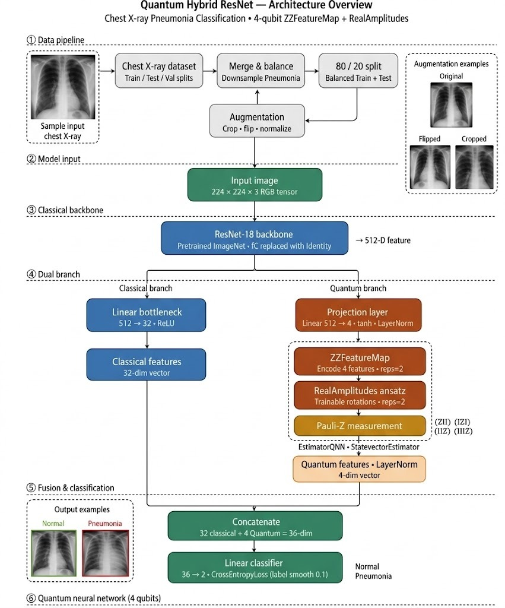
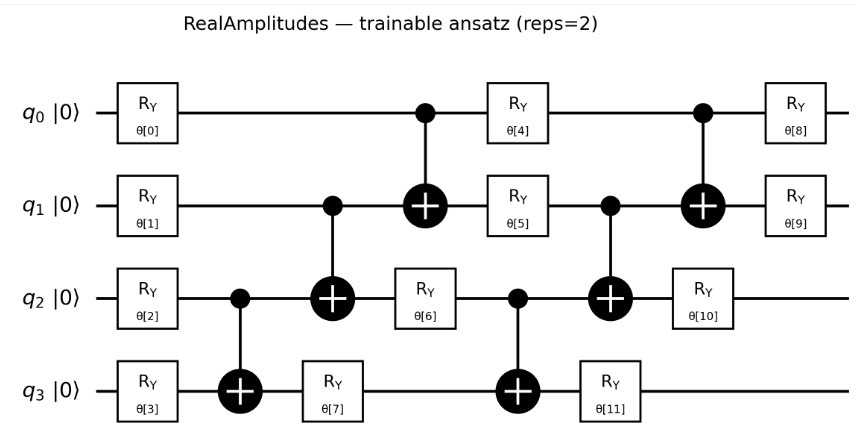
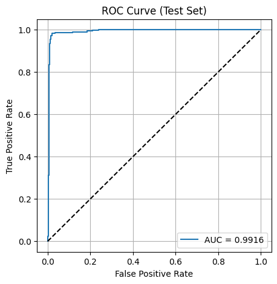
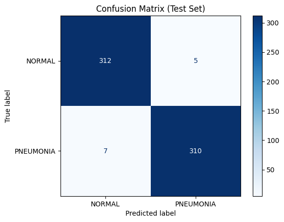

# Hybrid ResNet-QNN for Chest X-ray Classification

[](https://colab.research.google.com/github/SD-Abilesh/hybrid-cnn-qnn-pneumonia/blob/main/notebooks/hybrid-512-plus-1/warmup3_finetune15.ipynb)

An experimental portfolio project exploring hybrid classical-quantum learning for binary pneumonia classification from chest X-rays. A pretrained ResNet18 extracts image features, while Qiskit circuits provide a small trainable quantum branch. The repository preserves the main model, alternative feature allocations, training-schedule studies, and classical baselines.

> [!IMPORTANT]
> The supplied notebooks evaluate the test loader after every epoch and select checkpoints using test accuracy. The values below are retained historical development results, not an independently reproduced estimate from an untouched test set. This repository does not claim quantum advantage or clinical validity.

## Architecture

The experiments begin with a pretrained ResNet18 whose classification layer is replaced by an identity mapping, producing a 512-dimensional feature vector.

| Configuration | Classical branch | Quantum branch | Fused representation |
|---|---:|---:|---:|
| Hybrid 512+1 | 512 ResNet features | 512 → 4 projection, 4-qubit QNN, 1 measured output | 513 |
| Hybrid 32+4 | 512 → 32 with ReLU | 512 → 4 projection, 4-qubit QNN, 4 Pauli-Z expectations | 36 |
| Classical control | 512 → 36 | None | 36 |

The quantum circuit uses a `ZZFeatureMap` and `RealAmplitudes` ansatz with two repetitions, executed with Qiskit's statevector estimator and connected to PyTorch through `EstimatorQNN` and `TorchConnector`.



### Why test a 32+4 configuration?

The 32+4 model makes all four measured quantum expectations available to the classifier and produces the same 36-dimensional fused representation as the classical 36-feature control. This is a useful output-dimensionality comparison. It does **not** isolate a quantum advantage because parameter count, optimisation behaviour, nonlinear capacity, random seeds, and checkpoint selection are not fully controlled.



## Stored results

The main 512+1 notebook with three warmup epochs and fifteen end-to-end epochs recorded **98.11% accuracy** and **0.9916 ROC-AUC**. Its stored confusion matrix contains 312 true negatives, 310 true positives, 5 false positives, and 7 false negatives on a balanced 634-image split.

| Experiment | Schedule | Stored accuracy | Stored ROC-AUC |
|---|---:|---:|---:|
| Hybrid 512+1 | 3 warmup + 15 full | **98.11%** | **0.9916** |
| Hybrid 32+4 | 3 warmup + 10 full | 97.63% | 0.9955 |
| Classical 36-feature control | 3 warmup + 15 full | 97.79% | Not consistently recorded |
| ResNet18, 512 features | 3 warmup + 15 full | 97.48% | 0.9959 |
| ResNet18, no warmup | 15 full | 97.32% | 0.9967 |

These figures come from stored notebook outputs. They should not be treated as a fair model ranking until all variants are rerun with the same patient-level train/validation/test split, validation-selected checkpoints, fixed seeds, and repeated trials.

<p align="center">
  
  
</p>

## Repository layout

```text
assets/                       Architecture and stored evaluation figures
notebooks/
├── hybrid-512-plus-1/        Main model and schedule comparisons
├── hybrid-32-plus-4/         Matched-output hybrid experiments
└── baselines/                Classical comparison models
report/
└── project_notes.md          Method summary, interpretation, and limitations
requirements.txt              Core Python dependencies
```

The schedule experiments and baselines are kept because they show the ablation work rather than presenting only the best run. See [`notebooks/README.md`](notebooks/README.md) for the experiment map and known output inconsistencies.

## Running an experiment

1. Open a notebook in Google Colab.
2. Install the dependencies in `requirements.txt` or use the notebook's original install cell.
3. Replace the hard-coded `/content/drive/MyDrive/...` dataset and checkpoint paths.
4. Use a separate validation split for checkpoint selection.
5. Run a classical baseline first. Statevector QNN training is substantially slower than the classical models.

The dataset and trained checkpoints are not redistributed. Qiskit dependencies are intentionally left unpinned because the exact original Colab environment was not captured; API compatibility may require adjustment on a current release.

## Intended use

This repository is an educational and portfolio record of hybrid-model experimentation with PyTorch, transfer learning, Qiskit Machine Learning, and medical-image classification. It is not a diagnostic system and was not evaluated on quantum hardware.
